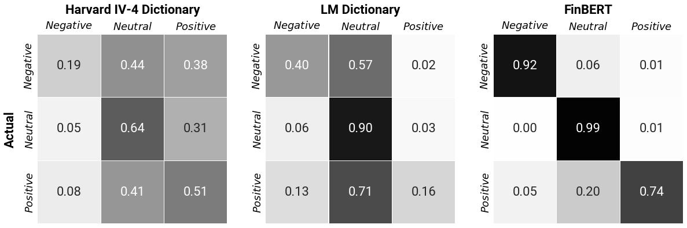

# Measuring Financial Tone in Earnings Calls: An evaluation of FinBERT

Repository for my MSc Data Science and Society master dissertation.

*Note: some of the outputs are cleared as the data is proprietary*

### Figures

**Figure 1:** Tone in earnings conference calls Q\&As. The figure shows the three-month moving average. Tone measures are standardised to have a mean of 0 and a standard deviation of 1.*

   

**Figure 2:**  Financial PhraseBank confusion matrix. Normalised by actual labels. This figure only concerns the statements with 100% agreement.